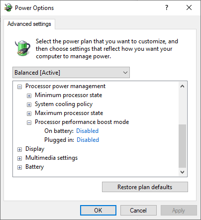

# mx150-graphics-settings
Make mx150 not throttle

1. Download and run the `processor_performance_boost_mode.reg` file

2. From `Power options` select `Processor power management` > `Processor performance boost mode`:
- On battery: Disabled
- Plugged in: Disabled

  

